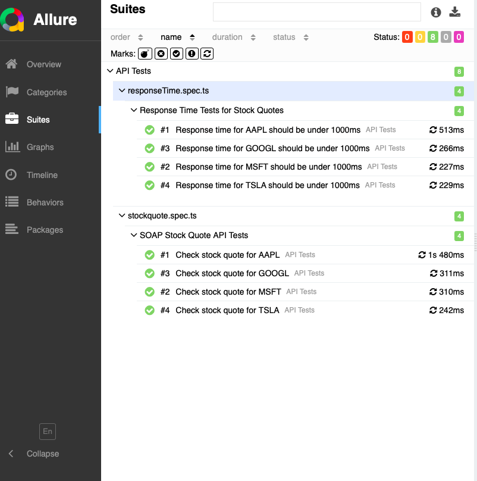
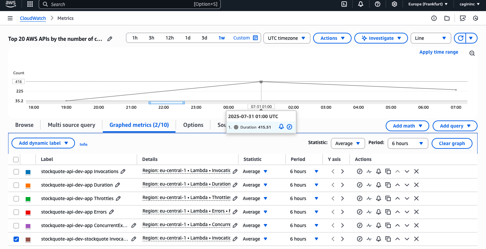

# 🧪 SOAP API Playwright Test Suite

> ## 🚀 Overview  
I built a **Node.js** server that exposes a SOAP endpoint for real-time stock quotes by proxying Alpha Vantage’s REST API.  
Using the **Serverless Framework**, I deployed this service on **AWS Lambda**, and set up **CloudWatch** dashboards to monitor invocation counts, error rates and response times.  
This test suite validates that the live Lambda endpoint and ensures reliability and performance.

## 🚀 Project Overview
A Node.js-based SOAP service that:
1. Fetches stock data from Alpha Vantage REST API
2. Converts JSON → XML
3. Serves through AWS Lambda
4. Validated with Playwright tests

## 📊 Reports

### 🧪 Allure Report  
> Detailed test steps, performance metrics, and retry logic.

---

### 📉 CloudWatch Dashboard  
> Lambda invocation counts, error rates, and average response latency over time.

## ✨ Features

- ✅ **Functional Validation** of XML requests/responses  
- ⚡ **Performance Awareness** via response-time assertions  
- 🧩 **Modular Design** with helpers & data-driven tests  
- 📈 **Professional Reporting** with Allure  

## 🛠️ Test Structure & Approach

1. **StockQuote Functional Test (`stockQuote.spec.ts`)**  
   - Sends real-time SOAP requests for various stock symbols.
   - Verifies response structure includes expected fields .
   - Checks for valid numeric values and correct symbol mapping.

2. **Performance Test (`responseTime.spec.ts`)**  
   - Measures response time for multiple stock quote requests.
   - Asserts that the response is returned within a set threshold (e.g., under 1000ms).
   - Helps detect latency regressions or cold-start effects in AWS Lambda.
---

